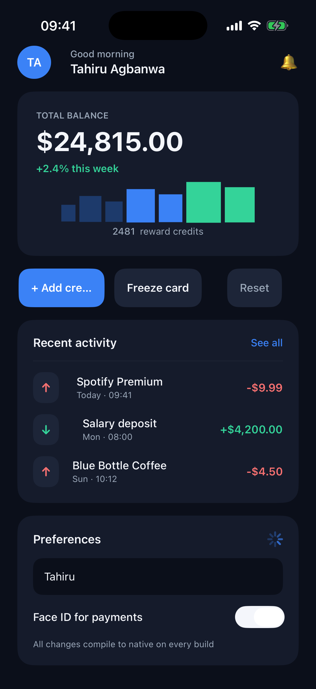

# DCFlight

<p align="center">
  <a href="https://github.com/DotCorr/DCFlight/actions/workflows/compiler.yml"></a>
  
  <a href="https://www.buymeacoffee.com/squirelboy360"></a>
</p>

<p align="center">
  
</p>

<p align="center"><em>A real, unmodified iPhone Simulator screenshot — a dark production-grade fintech UI compiled to pure SwiftUI from the one true source below. There is no DCFlight code inside the app.</em></p>

## What DCFlight actually is

DCFlight is **not a cross-platform framework**. There is no runtime, no renderer, no bridge, no engine, and nothing that ships inside your app.

DCFlight is a **cross-platform compiler** — a development-time tool that compiles one true source into **two real, independently native apps**: ordinary Swift/SwiftUI for iOS and ordinary Java/Android Views for Android. We call it *beside native, not on top of native*.

Almost every "cross-platform" tool is an **abstraction on top of native**: your code runs in an engine or runtime that owns the screen, talks to native views through a bridge, and ships inside every app you distribute.

```
   ┌────────────────────────────────────────────┐
   │  Cross-platform frameworks (the usual way) │
   │                                            │
   │         ┌──────────────────────┐           │
   │         │   Your framework     │           │
   │         │  runtime · bridge ·  │           │
   │         │  renderer · engine   │           │
   │         └──────────┬───────────┘           │
   │                    ▼                       │
   │   ┌─────────────┐    ┌──────────────┐      │
   │   │    iOS      │    │   Android    │      │
   │   │  (on top)   │    │   (on top)   │      │
   │   └─────────────┘    └──────────────┘      │
   │   Your app = framework + native underneath │
   └────────────────────────────────────────────┘
```

DCFlight has no layer on top. It is a tool that runs **only on your machine, at development time**, and its output is native source code that stands **beside** the platform toolchain — not above it:

```
   ┌────────────────────────────────────────────┐
   │              DCFlight (the new way)        │
   │                                            │
   │  One true source ──▶ dcflight compile      │
   │  (JSON or DC      │  (development-time     │
   │   Dart)           │   tool on your Mac)    │
   │                   ▼                        │
   │        ┌──────────────────────┐            │
   │        │  Pure native output  │            │
   │        └──────────┬───────────┘            │
   │          ┌────────┴─────────┐              │
   │          ▼                  ▼              │
   │   ┌─────────────┐    ┌──────────────┐      │
   │   │ Swift +     │    │ Java +       │      │
   │   │ SwiftUI     │    │ Android      │      │
   │   │ (Xcode      │    │ Views        │      │
   │   │ toolchain)  │    │ (Gradle      │      │
   │   │             │    │ toolchain)   │      │
   │   └─────────────┘    └──────────────┘      │
   │   Your app = 100% native. Nothing inside.  │
   └────────────────────────────────────────────┘
```

The compiled apps contain no DCFlight runtime, no Dart VM, no JavaScript engine, no bridge, no renderer, and no registry. They build with Xcode and Gradle exactly like hand-written native projects — because that is what they are. DCFlight steps out of the picture the moment compilation ends.

## One true source

Write your app once — as JSON, or as the restricted DC Dart form. An excerpt of the real showcase app ([full source](compiler/examples/showcase.json)):

```json
{
  "state": {"balance": "$24,815.00", "enabled": true, "count": 2481},
  "actions": [
    {"id": "addcredit", "op": "increment", "target": "count"},
    {"id": "resetcredit", "op": "set", "target": "count", "value": 0},
    {"id": "freeze", "op": "toggle", "target": "enabled"}
  ],
  "root": {
    "id": "home", "type": "column",
    "style": {"backgroundColor": "#0B0F1AFF", "padding": 22, "spacing": 16, "fillWidth": true},
    "children": [
      {"id": "bamount", "type": "text", "props": {"text": {"ref": "balance"}},
       "style": {"color": "#F4F6FBFF", "fontSize": 34, "fontWeight": "bold"}},
      {"id": "bchange", "type": "text", "props": {"text": "+2.4% this week"},
       "style": {"color": "#34D399FF", "fontSize": 13, "fontWeight": "semibold"}},
      {"id": "btnplus", "type": "button", "props": {"text": "+ Add credit"}, "action": "addcredit",
       "style": {"backgroundColor": "#3B82F6FF", "color": "#FFFFFFFF", "padding": 16, "cornerRadius": 14, "fillWidth": true}}
    ]
  }
}
```

Compile it and each platform gets its own real code. The same `count` state and `addcredit` action become a styled SwiftUI card observing an `AppModel` on iOS:

```swift
struct n_balancecard: View {
    @ObservedObject var model: AppModel
    var body: some View {
        VStack(alignment: .leading, spacing: 6) {
            n_blabel(model: model)
            n_bamount(model: model)
            n_bchange(model: model)
            n_sparkbars(model: model)
            n_creditrow(model: model)
        }
        .padding(24)
        .background(Color(dcHex: 0x151B2BFF))
        .cornerRadius(20)
        .frame(maxWidth: .infinity)
    }
}
```

with the balance text styled exactly as declared:

```swift
Text(model.s_balance)
    .font(.system(size: 34, weight: .bold))
    .foregroundColor(Color(dcHex: 0xF4F6FBFF))
```

and an ordinary Android `LinearLayout` with its own GradientDrawable, driving a plain Java model:

```java
n_balancecard = new android.widget.LinearLayout(activity);
n_balancecard.setPadding(24 * dp, 24 * dp, 24 * dp, 24 * dp);
android.graphics.drawable.GradientDrawable styled_n_balancecard =
    new android.graphics.drawable.GradientDrawable();
styled_n_balancecard.setColor(android.graphics.Color.parseColor("#ff151b2b"));
styled_n_balancecard.setCornerRadius(20 * dp);
n_balancecard.setBackground(styled_n_balancecard);
```

```java
public final class AppModel {
    public String s_balance = "$24,815.00";
    public int s_count = 2481;
    public void a_addcredit() { s_count++; }
    public void a_freeze() { s_enabled = !s_enabled; }
    public void a_resetcredit() { s_count = 0; }
}
```

No interpretation at runtime. The iOS output is SwiftUI; the Android output is Android Views; each is owned by its platform toolchain from that point on.

## Quick start

macOS with Xcode 16+ is required for the iOS run flow. Python 3.9+ is the only compiler dependency.

```sh
git clone https://github.com/DotCorr/DCFlight.git
cd DCFlight/compiler

# Create an app: generates both native projects from one source
./bin/dcflight create /absolute/path/to/my-app --name "My App" --id com.example.myapp

# Build, install and launch the iOS app in Simulator
./bin/dcflight run /absolute/path/to/my-app
```

Edit `app.json`, run `./bin/dcflight run` again — native rebuild and relaunch each time. That is the whole loop. (This is rebuild/relaunch, not hot reload — by design: the app on your device is pure native and has no DCFlight code in it to hot-reload.)

For Android, open the generated `native/android` project in Android Studio and press Run — it is an ordinary Gradle project (JDK 17, Gradle 8.11.1, Android SDK 35).

## Compiler commands

From `compiler/` (or install with `python3 -m pip install .` and use `dcflight` anywhere):

| Command | What it does |
| --- | --- |
| `create <dir>` | Scaffold an app and generate both native projects |
| `run <dir>` | Regenerate, build, install and launch in iOS Simulator |
| `compile <src> --out <dir>` | Generate native projects without launching (`--target ios`, `--target android`, `--dry-run`) |
| `validate <src>` | Check an app file against the reviewed native capability registry |
| `inspect <src>` | Print the canonical typed IR for an app file |
| `registry [query]` | Search the reviewed capability registry |
| `schema` | Emit the JSON schema for editor tooling |
| `audit <dir>` | Verify a generated project ships no DCFlight runtime |
| `mcp` | Development-only MCP server (`registry_search`, `app_schema`, `validate_app`) for AI tooling |

The registry is reviewed compiler code: every UI capability maps to a real SwiftUI symbol and a real Android View class, with checked property types. Unsupported semantics fail at compile time — never at runtime on your users' devices.

## Working with AI tools

Connect any MCP-capable coding agent to `python3 -m dcflight mcp` and it can search the capability registry, fetch the app schema, and validate app sources — so generated apps stay inside the reviewed, type-checked surface instead of hallucinating unsupported APIs. Validate before you compile; compilation never accepts what validation rejects.

## What ships in your app

Nothing from DCFlight. `audit` proves it on every generated project:

- No dcflight library, interpreter, renderer, registry, or dispatch layer
- No Dart VM, no JavaScript engine, no bridge
- The `.dcflight` metadata directory is stripped from detached builds
- UI is concrete `SwiftUI.View` structs and `android.view.ViewGroup` code; actions are concrete methods

Your generated projects are yours: user-owned native files are never overwritten, and conflicting edits to generated files stop regeneration instead of destroying work.

## Current scope

Reviewed capabilities today: text, counter, button, column, row, toggle, text field, divider, progress indicator, plus user-native view/action escape hatches — each with a reviewed style vocabulary (hex colors, font size and weight, padding, corner radius, spacing, alignment, fill width), so compiled apps look production-grade straight from the source. State: strings, Int32 and booleans. Actions: assignment, increment and boolean toggle. See `compiler/examples/catalog.json` and `compiler/examples/showcase.json`.

Not yet claimed: Web, Windows and Linux backends (extension points exist), production navigation, persistence, animations, and arbitrary Dart logic translation. The compiler is honest about what it supports — unsupported means unsupported, at compile time.

## Contributing

Issues and PRs welcome — read `compiler/AGENTS.md` for the invariants (development-time only; nothing ever ships in generated apps).

## License

DCFlight is licensed under the [PolyForm Noncommercial License 1.0.0](compiler/LICENSE). Commercial use requires a license from DotCorr — contact tahiru@dotcorr.com.

## Support

Your support fuels the grind. Every contribution keeps this journey alive.

<a href="https://www.buymeacoffee.com/squirelboy360"></a>

---

Built with ❤️ by [DotCorr](https://github.com/DotCorr) · dcflight.dev
