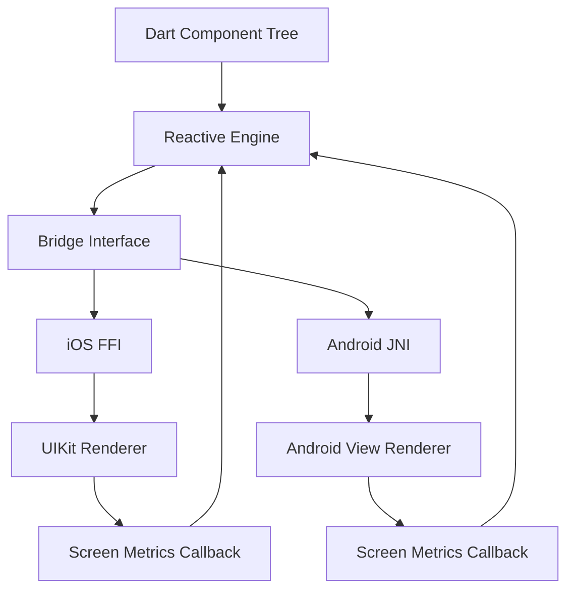

```
# DCFlight

DCFlight is a native-first mobile UI framework that uses the Flutter engine only for Dart runtime services. Rendering diverges into native views immediately:

- iOS uses FFI to call the native renderer.
- Android uses JNI to call the native renderer.
- The active framework path does not use Flutter method channels for rendering, layout, events, or screen-dimension updates.

## What It Is

DCFlight renders UIKit views on iOS and Android Views on Android from a declarative Dart component tree.

Current architecture goals:

- Native view ownership on both platforms
- Fine-grained reactive updates from Dart
- Yoga-based layout calculation
- Direct native bridge calls through FFI/JNI
- No platform-view embedding layer
- No mixed Flutter-widget fallback in the supported runtime

## Current Runtime Model

```text
Dart components
  -> reactive engine
  -> native bridge interface
  -> iOS FFI / Android JNI
  -> UIKit / Android Views
```

## Architecture View



## Current Design Constraints

- Safe-area and screen metrics must trigger app-level rerenders, not only listener callbacks.
- Animation, layout, and styling have to converge on the same native property/update path.
- Sidecar bridge paths are treated as architecture debt and removed rather than left dormant.

The old mixed bridge surfaces have been removed from the supported runtime. In particular, the Flutter-widget embedding path and its platform-channel bridge are no longer part of the active framework surface.

## Workspace Layout

- `packages/dcflight`: core engine and bridge
- `packages/dcf_primitives`: native UI primitives
- `packages/dcf_screens`: navigation and screen lifecycle
- `packages/dcf_reanimated`: animation/worklet layer
- `cli`: scaffolding tools

## Development Status

- iOS example app builds and runs through the FFI-backed renderer
- Android runtime is centered on JNI-backed bridge calls
- Documentation has been consolidated around the current architecture instead of legacy experiments

## Where To Read Next

- `packages/dcflight/ARCHITECTURE.md`
- `TECHNICAL_ANALYSIS.md`
- `FRAMEWORK_GUIDELINES.md`

Create a new module:

```bash
dcf create module
```

See [CLI Guide](docs/cli/CLI_GUIDE.md) for more information.

## 📚 Documentation

### Getting Started
- [Framework Overview](docs/FRAMEWORK_OVERVIEW.md) - Architecture and concepts
- [Component Protocol](docs/COMPONENT_PROTOCOL.md) - Component development guide
- [Event System](docs/EVENT_SYSTEM.md) - Event handling and propagation
- [WidgetToDCFAdaptor](docs/WIDGET_TO_DCF_ADAPTOR.md) - Embed Flutter widgets in DCFlight

### Development Guides
- [Framework Guidelines](FRAMEWORK_GUIDELINES.md) - Complete development guide
- [Module Development](packages/template/dcf_module/GUIDELINES.md) - Creating modules
- [Component Conventions](docs/COMPONENT_CONVENTIONS.md) - Naming and patterns

### Contributing
- [Contributing Guide](CONTRIBUTING.md) - How to contribute to DCFlight
- [Code of Conduct](CONTRIBUTING.md#code-of-conduct) - Community guidelines

### Technical Documentation
- [Registry System](docs/REGISTRY_SYSTEM.md) - Component registration
- [Tunnel System](docs/TUNNEL_SYSTEM.md) - Native method calls
- [Architecture Comparison](docs/ARCHITECTURE_COMPARISON.md) - Framework comparison
- [DCFPlatformView Design](docs/DCFPlatformView_DESIGN.md) - Cheap DCF/native embedding in Flutter (single-surface approach)

## 🏗️ Architecture

DCFlight follows a layered architecture:

```
┌─────────────────────────────────────┐
│    Dart Layer (Components)          │
│  StatelessComponent / StatefulComponent │
└─────────────────────────────────────┘
              ↓
┌─────────────────────────────────────┐
│      VDOM Engine (Reconciliation)    │
│  Component Diffing & Update Batching │
└─────────────────────────────────────┘
              ↓
┌─────────────────────────────────────┐
│      Native Bridge Interface         │
│  Communication Layer (Swappable)     │
└─────────────────────────────────────┘
              ↓
┌─────────────────────────────────────┐
│    Native Layer (iOS/Android)        │
│  DCFComponent Implementation         │
└─────────────────────────────────────┘
```

## 🎯 Key Features

- **Native UI Rendering** - Direct native views, no platform views or abstractions
- **Component-Based** - Declarative component architecture with state management
- **Cross-Platform** - Write once, native on both platforms
- **VDOM System** - Efficient updates with virtual DOM diffing and reconciliation
- **Yoga Layout** - Flexbox-based layout engine for consistent layouts
- **Hot Reload** - Fast development iteration with hot restart support
- **Type-Safe** - Full Dart type safety throughout the framework
- **Extensible** - Plugin system for creating custom modules and components

## 🤝 Contributing

We welcome contributions! Please see our [Contributing Guide](CONTRIBUTING.md) for details.

- Read [Framework Guidelines](FRAMEWORK_GUIDELINES.md) for development practices
- Check [Component Protocol](docs/COMPONENT_PROTOCOL.md) for component development
- Follow our [Code of Conduct](CONTRIBUTING.md#code-of-conduct)

## 📄 License

DCFlight is dual-licensed.

### Open Use (Noncommercial)
Licensed under the PolyForm Noncommercial License 1.0.0.

You may use DCFlight for:
- Personal projects
- Education
- Research
- Open-source software
- Non-profit and government use

### Commercial Use
Any commercial or revenue-generating use requires a paid
Commercial License. This includes SaaS, mobile apps, internal tools,
and embedded products.

Contact: licensing@dotcorr.com

## ☕ Support

> **Your support fuels the grind. Every contribution keeps this journey alive.**

[](https://coff.ee/squirelboy360)

---

**Built with ❤️**
