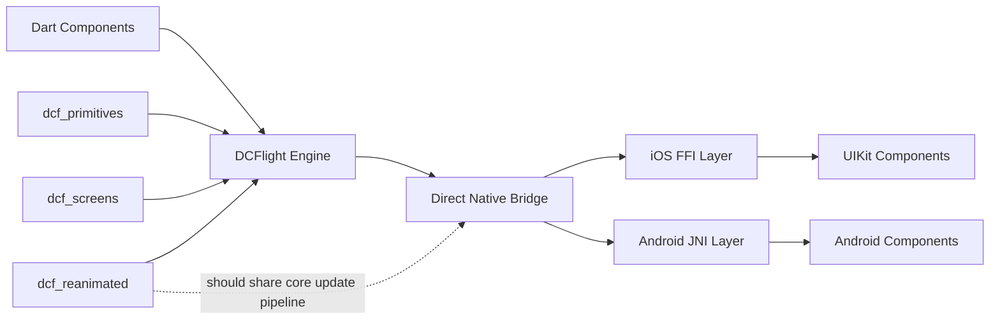

# DCFlight Technical Analysis

## Scope

This document describes the current technical state of DCFlight after consolidating the runtime around native rendering only.

## Architecture Summary

DCFlight uses the Flutter engine as infrastructure for Dart execution, then hands rendering to native systems immediately:

- iOS: FFI bridge into native renderer
- Android: JNI bridge into native renderer
- Layout: Yoga-backed native layout coordination
- Events: native callback dispatch back into Dart

## Active Bridge Surface

### Supported

- Native view creation, update, attach, detach, and delete through FFI/JNI
- Batch updates through FFI/JNI
- Native event callbacks through FFI/JNI callback registration
- Screen dimension and safe-area notifications through FFI/JNI callbacks

### Removed From Active Runtime

- Flutter widget embedding through `dcflight/flutter_widget`
- Native `FlutterWidget` component registration
- Android plugin control method channel
- iOS layout method-channel handler that was no longer part of the active path

## Why The Rewrite Was Needed

The repository had accumulated multiple generations of architecture:

- pure native rendering goals
- older method-channel helper code
- experimental Flutter-widget embedding
- docs that described different systems at different points in time

That left the runtime and the docs disagreeing with each other.

## Current Code-Level Decisions

1. `WidgetToDCFAdaptor` is no longer a supported runtime feature.
2. Flutter-widget native host components were removed from active registration.
3. Android plugin initialization no longer exposes an extra control `MethodChannel` for startup.
4. Screen utilities remain native-callback based and are documented that way.

## Animation And Layout Analysis

`dcf_reanimated` has useful primitives and value types, but its current shape is still package-layer driven rather than obviously centered on a single shared animation core that co-owns layout, transforms, and styling updates.

What exists now:

- animation values and transitions in `dcf_reanimated`
- `Motion` and `ReanimatedView` as high-level component APIs
- worklet execution hooks layered onto the native renderer

What still needs architectural tightening:

- one clear animation core that owns frame progression
- one clean contract for animated layout vs normal layout
- one consistent property pipeline for style, transform, and layout mutations

That gap does not block the renderer rewrite done here, but it is a real architectural follow-up item.

## Architecture Visualization

## Consequences

### Good

- The supported renderer path is easier to reason about.
- Native bridge claims now match the actual active runtime.
- iOS and Android documentation align on FFI/JNI ownership.

### Tradeoff

- Mixing arbitrary Flutter widgets into DCFlight is no longer supported.
- If that feature returns later, it should come back through a direct native bridge design rather than a platform-channel sidepath.

## Documentation Cleanup Policy

The following kinds of documents were removed during consolidation:

- one-off cleanup summaries
- stale implementation comparisons
- internal architecture notes that described deleted runtime paths

Canonical docs now live in:

- `README.md`
- `packages/dcflight/README.md`
- `packages/dcflight/ARCHITECTURE.md`
- `TECHNICAL_ANALYSIS.md`